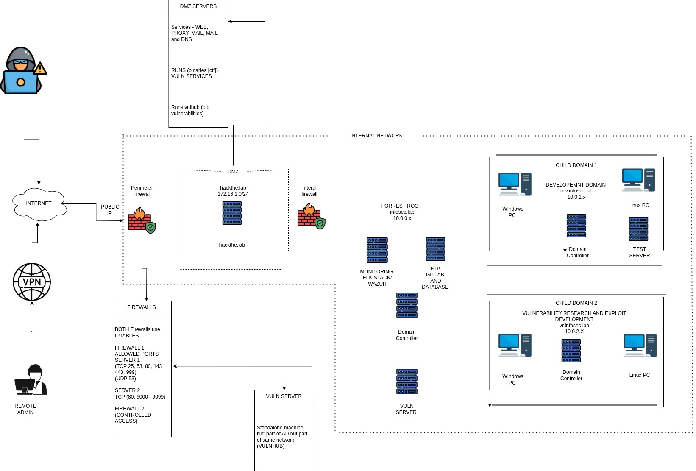

# Offensive Security Playground

As i dive more into offensive security I realised that I am going to need a Red Team lab that simulates a real-world enterprise environment. I'm excited to start building my ultimate cybersecurity lab environment, my playground for all things offensive and defensive security.

I designed this to be like a realistic network. This lab will help me practice and hone my skills in the following fields:
- Red Teaming
- Vulnerability Research
- Exploit Development
- Software Development

### Red Teaming
I will use this lab to get hands-on red teaming experience by acting as the threat actor to simulate real word scenarios - from external reconnaissance, to lateral movement and privilege escalation and level up as a offensive security practitioner in training. 

##### Goal
The goal it to think, act and adapt like a adversary while sharpening my skills across multiple layers of a corporate infrastructure.

### Vulnerability Research and Exploit Development
VR and exploit dev is not just about popping shells - it is about deeply understanding how software breaks, how bugs can be turned into weapons (exploits) and how real attackers operate at the binary level.

The dedicated VR and exploit dev domain will be a isolated zone where i will sharpen m VR by actively hunting bugs in legacy software. Older system will provide a perfect training ground because they are full of insecure practices, outdated code, and known vulnerabilities that make it ideal for a beginner like myself.

##### Goal
The goal is to become comfortable identifying and weaponizing vulnerabilities. Over time, I want to contribute my CVEs.

### Software Development (security focus)
This domain serves as a space where I can sharpen my software development skills, with a focus on secure coding, offensive tooling, and red team automation. I think to understand how software breaks, you also need how software is built and it works. 

##### Goal
I eventually want to build my own malware lab toolkit, develop PoCs that accompany the CVEs I research and contribute to open-source offensive security tools.

## Lab Architecture Overview

### Network Architecture Overview

Here’s a high-level overview of the lab design:
The environment includes:

- A DMZ 
- Two firewalls using `iptables`
- An internal enterprise network
- Centralized monitoring
- Domain Controllers for Active Directory simulations
- Vulnerable machines for Red Team/CTF-style exploitation

### Demilitarized Zone: First line of attack and defense.
DMZ is a small, isolated network segment that sits between the public internet and internal network. It hosts public facing services. I've specifically put vulnerable services here for initial attack practice.
The services:
- Running pwn ctf binarys using socat
- Running vulnerable services (vulhub)
- Web
- DNS
- SMTP

### Two Firewalls
Firewalls are network security devices that will be implemented using linux containers in this case (`iptables`) that control incoming and outgoing network traffic based on predefined rules. They enforce network security policies by filtering traffic. I'll use them to simulate realistic network segmentation, practice bypassing firewall rules, and test how traffic flows (or is blocked) between different zones in the lab.

### Internal Enterprise Network 
This is the main network area of my lab, where sensitive data and most internal operations occur. his is where I'll practice lateral movement, privilege escalation, and complex attacks within a realistic, segmented network.

### Centralised Monitory 
This is a security monitoring system that collects and analyses logs and security events from various systems across the network. This will help me practice some blue team skills by detecting simulated attacks, analysing security incidents and understanding how my offensive actions might be observed.
Technologies that will be used:
- ELK stack
- Wazuh

### **Domain Controllers for Active Directory simulations**:
These are servers running Microsoft Active Directory, which is a directory service used by windows-based networks (will try to also include linux workstations in AD) for managing users and computers. They provide a realistic environment to practice Active Directory-specific attacks, such as credential harvesting, privilege escalation within domains, and exploiting trust relationships between parent and child domains to simulate full enterprise compromise.

### Vulnerable Machines for Red Team/CTF-style exploitation
They will serve as my primary targets for offensive security practice. I will use virtual machines from websites like [VulnHub](https://www.vulnhub.com),  [HackMyVM](https://hackmyvm.eu), etc.

# Conclusion
Building this lab is not just about spinning up a few virtual machines - it is about creating a realistic cybersecurity play ground where I can evolve as both an attacker and a defender.
This is not just a lab - it is my offensive security gym, and it's structured in a way that reflects real-world targets. 

Stay tuned as I document the builds, breakthroughs, failures, and lessons learned from my ultimate red team lab.