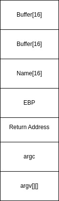

## Memory Corruption
Modifying memory of a binary in a way that was not intended


```c
int main() {
	char Name[16] = "binexp";
	char buffer[32];
	gets(buffer);	
	return 0;
}
```

Stack before gets function




